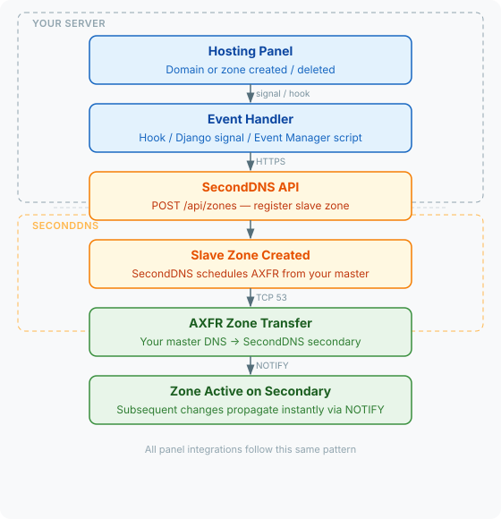

# dns_integrations

[](LICENSE)
[](LICENSE.COMMERCIAL)

Integrations for [SecondDNS](https://seconddns.com) — a secondary DNS service that keeps your zones in sync via AXFR zone transfers. This repository contains hosting panel plugins and monitoring templates that automate zone registration and health checks.

---

## How it works



All integrations use the same pattern: catch the panel event, call the SecondDNS API, let AXFR do the rest.

---

## Hosting panels

| Panel | Mechanism | Tested on |
|:------|:----------|:----------|
| [cPanel/WHM](hosting-panels/cpanel/) | Standardized Hooks via `manage_hooks` (4 events) | cPanel/WHM v82+ |
| [CyberPanel](hosting-panels/cyberpanel/) | Django signals (`postWebsiteCreation`, `postZoneCreation`) | CyberPanel 2.4.5 |
| [DirectAdmin](hosting-panels/directadmin/) | Custom hooks (`dns_create_post`, `dns_delete_post`) | DirectAdmin 1.699 |
| [Plesk](hosting-panels/plesk/) | Event Manager (12 events, incl. rename + aliases) | Plesk Obsidian 18.0.77.2 |

### Quick install

All installers accept `--api-key=YOUR_API_KEY` and are safe to run as root:

```bash
# cPanel/WHM
curl -sL https://raw.githubusercontent.com/seconddns/dns_integrations/main/hosting-panels/cpanel/install.sh \
  | bash -s -- --api-key=YOUR_API_KEY

# CyberPanel
curl -sL https://raw.githubusercontent.com/seconddns/dns_integrations/main/hosting-panels/cyberpanel/install.sh \
  | bash -s -- --api-key=YOUR_API_KEY

# DirectAdmin
curl -sL https://raw.githubusercontent.com/seconddns/dns_integrations/main/hosting-panels/directadmin/install.sh \
  | bash -s -- --api-key=YOUR_API_KEY

# Plesk
curl -sL https://raw.githubusercontent.com/seconddns/dns_integrations/main/hosting-panels/plesk/install.sh \
  | bash -s -- --api-key=YOUR_API_KEY
```

See the README in each directory for options, AXFR configuration, and troubleshooting.

### Offline operation queue

Every panel integration ships with a local offline queue
([`hosting-panels/common/seconddns-queue`](hosting-panels/common/seconddns-queue)).
Every hook first passes the zone name through
[`seconddns-domain`](hosting-panels/common/seconddns-domain) (lowercase, IDNA2008
Punycode via `idn2`, LDH check); a name that fails is logged with the reason and
never enqueued.
Panel hooks enqueue zone operations into a SQLite database
(`/var/lib/seconddns/queue.db`); the `seconddns-queued` systemd worker is the
single delivery path — after every enqueue the hook pokes the worker through a
unix datagram socket (`/var/lib/seconddns/queued.sock`), so delivery starts
instantly with no polling; a rare fallback tick (`poll_interval`, 60 s) only
guards against lost wakeups. Operations are delivered in strict FIFO order. If the SecondDNS API is unreachable (outage or maintenance), the
worker backs off exponentially and retries until everything is delivered.
Nothing your customers do in the panel during a SecondDNS downtime is lost,
and hooks never block on API timeouts (they only do a local INSERT).

Worker settings (optional `[queue]` section in `/etc/seconddns.conf`):

```ini
[queue]
poll_interval = 60     # fallback idle tick (wakeups are socket-driven)
http_timeout = 15      # seconds per API request
backoff_min = 30       # first retry delay when the API is down
backoff_max = 300      # retry delay ceiling
```

Replay semantics:

- retryable errors (timeout, 5xx, redirects) pause delivery; the worker retries with exponential backoff
- duplicate delivery is safe: `409` on create and `404` on delete count as success
- hard errors (`400`/`422`) mark the operation `failed` and the drain continues

Inspect the queue on any panel server:

```bash
seconddns-queue status              # pending / failed / oldest age (exit 0/1/2)
seconddns-queue status --json       # same as JSON (for monitoring agents)
seconddns-queue flush               # manual one-shot drain (diagnostics)
systemctl status seconddns-queued   # delivery worker
```

Requires `sqlite3` (present by default on all supported panels).

---

## Monitoring

| Tool | Type | What it checks |
|:-----|:-----|:---------------|
| [Nagios / Icinga](nagios_plugins/) | Check plugin (bash) | Zone sync status, stale zones, master reachability |
| [Nagios / Icinga](nagios_plugins/check_seconddns_queue.sh) | Check plugin (bash) | Offline queue backlog on a panel server (`-w`/`-c` age thresholds) |
| [Zabbix](zabbix_templates/) | HTTP Agent template | Zone counters, triggers, graphs — no agent required |
| [Zabbix](zabbix_templates/seconddns_queue.yaml) | Agent template | Offline queue backlog on a panel server (needs a `UserParameter`) |

Both integrations use the SecondDNS API key. See the README in each directory for installation and configuration.

---

## Requirements

- SecondDNS account and API key — [get one here](https://seconddns.com/dashboard/api-key)
- TCP port 53 open from your server to the SecondDNS secondary nameserver IP
- BIND or PowerDNS configured with `allow-transfer` and `also-notify` for the secondary IP

---

## License

Dual-licensed:

- **[GPL-3.0](LICENSE)** — free for open-source and personal use
- **[Commercial](LICENSE.COMMERCIAL)** — available for commercial deployments; contact [SecondDNS](https://seconddns.com) for details
