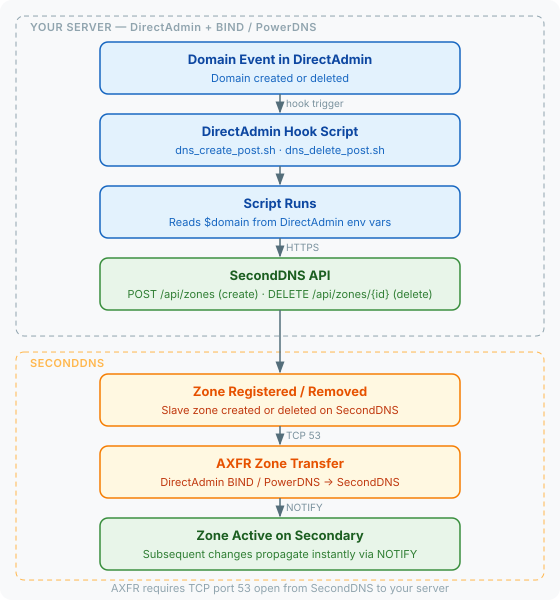

# SecondDNS — DirectAdmin Hosting Panel Integration

Automatically sync DNS zones from DirectAdmin to SecondDNS via AXFR zone transfers.

## How it works



DirectAdmin provides [custom hook scripts](https://docs.directadmin.com/developer/hooks/dns.html) that run after DNS events. This integration installs three hooks:

- **dns_create_post.sh** — when a domain is created, adds the zone to SecondDNS
- **dns_delete_post.sh** — when a domain is deleted, removes the zone from SecondDNS
- **domain_change_post.sh** — when a domain is renamed, removes the old zone and adds the new one. DirectAdmin fires no DNS create event on a rename, so without this hook the zone would disappear from the secondary and never come back

Zone data is transferred via AXFR from your DirectAdmin server to the SecondDNS secondary nameserver.

## Tested on

- DirectAdmin 1.699 with BIND/named on Ubuntu 22.04
- DirectAdmin 1.709 with BIND/named on AlmaLinux 9.8

## Requirements

- DirectAdmin 1.6+ (it writes zones for BIND/named, its only DNS server)
- `python3` and `sqlite3` — the installer stops if `python3` is missing
- Root access
- SecondDNS API key — [get one here](https://seconddns.com/dashboard/api-key)

## Install

```bash
curl -sL "https://raw.githubusercontent.com/seconddns/dns_integrations/main/hosting-panels/directadmin/install.sh" \
  | bash -s -- --api-key=YOUR_API_KEY
```

## Uninstall

```bash
curl -sL "https://raw.githubusercontent.com/seconddns/dns_integrations/main/hosting-panels/directadmin/uninstall.sh" \
  | bash
```

## AXFR — done by the installer

The installer configures this: it edits the `options` block of `named.conf`
after asking, keeps a `.bak` copy and reloads named.

```
allow-transfer { <secondary-ip>; };
also-notify { <secondary-ip>; };
```

Only needed by hand if you declined the prompt.

## Nameserver Configuration

Add the secondary nameserver to your domains. In DirectAdmin:

1. Go to **DNS Administration** or **DNS Management**
2. Add an NS record with the nameserver shown in your SecondDNS dashboard (for example `ns2.seconddns.com.`) — accounts are served by different nameservers, so take the name from there rather than from this page

Or update the default zone template to include it for all new domains.

## Troubleshooting

**Check logs:**
```bash
tail -f /var/log/seconddns.log
```

**Verify hooks are installed** (three of them; the rename hook is not a `dns_` one):
```bash
ls -la /usr/local/directadmin/scripts/custom/{dns_create_post,dns_delete_post,domain_change_post}.sh
```

**Test hook manually:**
```bash
domain=example.com username=admin caller=create:domain \
  /usr/local/directadmin/scripts/custom/dns_create_post.sh
```

**Zone not syncing:**
- Check AXFR is allowed: `dig @your-server example.com AXFR`
- Check firewall rules for TCP port 53
- Verify NOTIFY is configured (`also-notify`)
